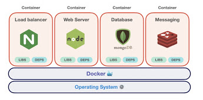
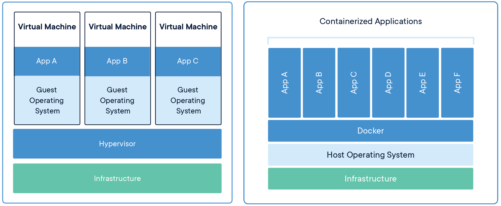
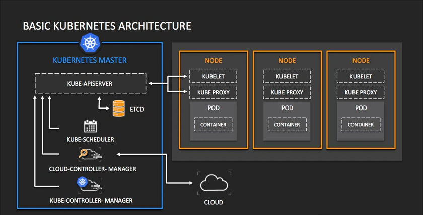

# Hello, Docker!
## What is Docker?
Docker is an open source platform for building, deploying, and managing containerized applications. Docker enables you to separate your applications from your infrastructure so you can deliver software quickly. 

It is based on the idea that you can package your code with dependencies into a deployable unit called a "container" that has everything the software needs to run including libraries, system tools, code, and runtime. 

## Wait, but what's a "Container"?
A container is a standard unit of software that packages up code and all its dependencies so the application runs quickly and reliably from one computing environment to another. 

Containers are made possible by process isolation and virtualization capabilities built into the Linux kernel. As a result, container technology offers all the functionality and benefits of VMs - including application isolation, cost-effective scalability, and disposability - plus important additional advantages:

* Lighter weight
* Greater resource efficiency
* Improved developer productivity

## That's too much of jargons, can you give me a simple analogy?
Perhaps a simple analogy can help getting the grasp of the core concept of Docker...

Let's go back in time to the 1950s for a moment. There were no word processors, and the photocopiers were used everywhere (kind of).

Imagine you're responsible for quickly issuing batches of letters as required, to mail them to customers, using real paper and envelopes, to be delivered physically to each customer's address (there was no email back then).

At some point, you realize the letters are just a composition of a large set of paragraphs, which are picked and arranged as needed, according to the purpose of the letter, so you devise a system to issue letters quickly, expecting to get a hefty raise.

The system is simple:

You begin with a deck of transparent sheets containing one paragraph each.

To issue a set of letters, you pick the sheets with the paragraphs you need, then you stack and align them so they look and read fine.

Finally, you place the set in the photocopier and press start to produce as many letters as required.

So, simplifying, that's the core idea of Docker.

In Docker, each layer is the resulting set of changes that happen to the filesystem after executing a command, such as, installing a program.

So, when you "look" at the filesystem after the layer has been copied, you see all the files, included the layer when the program was installed.

You can think of an image as an auxiliary read-only hard disk ready to be installed in a "computer" where the operating system is already installed.

Similarly, you can think of a container as the "computer" with the image hard disk installed. The container, just like a computer, can be powered on or off.

## Why use Docker
Using Docker lets you ship software faster, standardize application operations, seamlessly move code, and save money by improving resource utilization.

With Docker, you get a single object that can reliably run anywhere. Docker's simple and straightforward syntax gives you full control. Wide adoption means there's a robust ecosystem of tools and off-the-shelf applications that are ready to use with Docker.

Docker is so popular today that `Docker` and `containers` are used interchangeably.

## But we already have Virtual Machines? Why Containers?

Containers | Virtual Machines
-|-
Containers are an abstraction at the Application layer that packages code and dependencies together. | Virtual machines (VMs) are an abstraction of physical hardware turning one server into many servers.
Multiple containers can run on the same machine and share the OS kernel with other containers, each running as isolated processes in user space.  | The hypervisor allows multiple VMs to run on a single machine. 
Containers take up less space than VMs (container images are typically tens of MBs in size), can handle more applications and require fewer VMs and Operating systems. | Each VM includes a full copy of an operating system, the application, necessary binaries and libraries - taking up tens of GBs.
Containers boot up quickly  | VMs can be slow to boot.

## Docker tools and terms
Let us familiarize ourselves with Docker terminology.

### DockerFile
Every Docker container starts with a simple text file containing instructions for how to build the Docker container image. DockerFile automates the process of Docker image creation. It’s essentially a list of command-line interface (CLI) instructions that Docker Engine will run in order to assemble the image.

### Docker images
Docker images contain executable application source code as well as all the tools, libraries, and dependencies that the application code needs to run as a container. When you run the Docker image, it becomes one instance (or multiple instances) of the container.

### Docker containers
Docker containers are the live, running instances of Docker images. While Docker images are read-only files, containers are live, ephemeral, executable content. Users can interact with them, and administrators can adjust their settings and conditions using docker commands.

### Docker Hub
Docker Hub is the public repository of Docker images.

### Docker daemon
Docker daemon is a service running on your operating system, such as Microsoft Windows or Apple MacOS or iOS. This service creates and manages your Docker images for you using the commands from the client, acting as the control center of your Docker implementation.

### Docker registry
A Docker registry is a scalable open-source storage and distribution system for docker images. The registry enables you to track image versions in repositories, using tagging for identification. This is accomplished using Git, a version control tool.

## When to use Docker
You can use Docker containers as a core building block creating modern applications and platforms. Docker makes it easy to build and run distributed microservices architecures, deploy your code with standardized continuous integration and delivery pipelines, build highly-scalable data processing systems, and create fully-managed platforms for your developers. 

### Micro-Services

Build and scale distributed application architectures by taking advantage of standardized code deployments using Docker containers.

### Continuous Integration & Delivery
Accelerate application delivery by standardizing environments and removing conflicts between language stacks and versions.

## Docker deployment and orchestration
If you're running only a few containers, it's fairly simple to manage your application within Docker Engine, the industry de facto runtime. But if your deployment comprises thousands of containers and hundreds of services, it's nearly impossible to manage that workflow without the help of these purpose-built tools.

### Docker Compose
If you're building an application out of processes in multiple containers that all reside on the same host, you can use Docker Compose to manage the application's architecture. Docker Compose creates a YAML file that specifies which services are included in the application and can deploy and run containers with a single command. Using Docker Compose, you can also define persistent volumes for storage, specify base nodes, and document and configure service dependencies.

### Kubernetes
To monitor and manage container lifecycles in more complex environments, you'll need to turn to a container orchestration tool. While Docker includes its own orchestration tool (called Docker Swarm), most developers choose Kubernetes instead.

Kubernetes is an open-source container orchestration platform descended from a project developed for internal use at Google. 

Kubernetes schedules and automates tasks integral to the management of container-based architectures, including container deployment, updates, service discovery, storage provisioning, load balancing, health monitoring, and more.

## Next steps
Visit official Docker website to learn more. All major clouds e.g. Azure, AWS, Google Cloud have Containers offerings, visit their sites for more info.